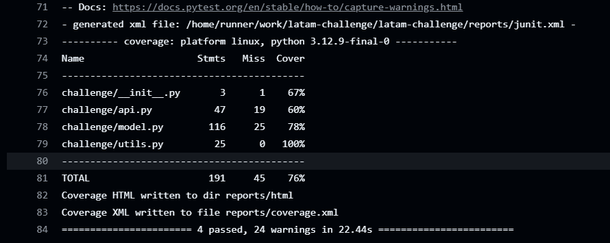
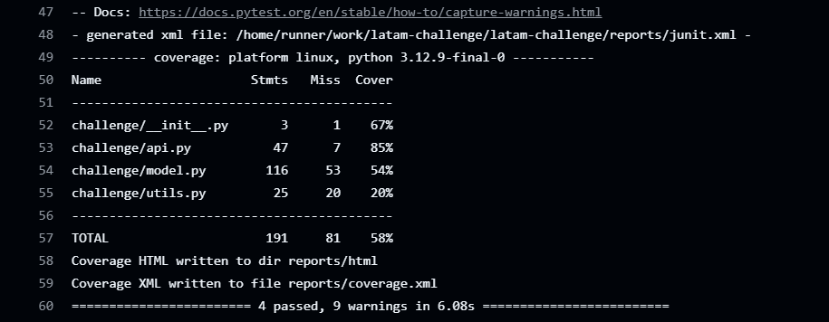
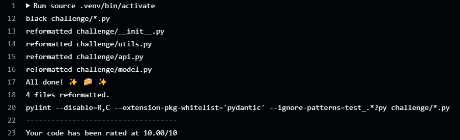

[](https://github.com/ai-product-manager/latam-challenge/actions/workflows/ci.yml)

[](https://github.com/ai-product-manager/latam-challenge/actions/workflows/cd.yml)

# Challenge Documentation

## 1. Executive Overview

Airports face significant challenges when flights are delayed, which directly impacts operational efficiency and customer satisfaction. Our solution transforms a data science notebook into a production-grade, scalable service that delivers **real-time flight delay predictions**. We achieved this by building a robust pipeline composed of four integrated parts:

- **Part I - Model**
- **Part II - API**
- **Part III - Deployment**
- **Part IV - CI/CD & Code Quality Best Practices**

This document focuses on **Part I – Model**, explaining our model selection, key implementation details, and test results.

---

## 2. Part I – Model

### 2.1 Business Context and Model Selection

Flight delay prediction is critical for airport operations to reduce costs and improve passenger experience. We evaluated several algorithms—including **RandomForestClassifier** and **Logistic Regression**—and found that **XGBoost (XGBClassifier)** provided the best balance of predictive performance and computational efficiency.

**Why XGBoost?**  
- **High Predictive Power:** XGBoost achieved a recall for delayed flights above our threshold of 0.60.
- **Handling Imbalance:** The model’s `scale_pos_weight` parameter effectively adjusts for class imbalance.
- **Efficiency and Scalability:** Faster convergence and robust performance under various operational loads.

This led us to encapsulate our chosen model in the `DelayModel` class (located in `model.py`).

---

### 2.2 Key Code Excerpt

Below is a key snippet from our `DelayModel` class, illustrating how we handle class imbalance and train our model:

```python
def fit(self, features: pd.DataFrame, target: pd.DataFrame) -> None:
    try:
        x_train, _, y_train, _ = self.__split_data(features, target)
        y_train_arr = y_train.values.ravel()

        # Count the number of negative (class 0) and positive (class 1) samples
        n_y1 = np.sum(y_train_arr == 1)
        n_y0 = np.sum(y_train_arr == 0)

        # Adjust for class imbalance: multiply ratio by 1.3 to emphasize minority class
        scale_weight = (n_y0 / n_y1) * 1.3 if n_y1 > 0 else 1

        # Configure and train the model using XGBoost
        params = {**self._default_model_params, "scale_pos_weight": scale_weight}
        self._model = xgb.XGBClassifier(**params)
        self._model.fit(x_train, y_train_arr)
        logger.info("Model training complete.")
        self.__save(params)
    except Exception as e:  # pylint: disable=broad-exception-caught
        logger.exception("Error in fit: %s", e)
        raise
```

**Highlights:**

- **Class Imbalance Handling:** We compute the ratio of negatives to positives and multiply by 1.3 to enhance sensitivity for the delayed flight class.
- **Model Configuration:** Our hyperparameters (200 estimators, max depth of 8, learning rate of 0.01, etc.) are carefully tuned to capture complex patterns without overfitting.
- **Robust Error Handling:** Any exceptions during training are logged and re-raised, ensuring transparency in case of issues.

### 2.3 Test Results

**Model Unit Tests:**

Executed via make model-test, these tests confirm that our model consistently meets our performance thresholds (e.g., recall above 0.60 for delayed flights) and validate the correctness of our processing logic.




### 2.4 Conclusion for Part I – Model

By selecting XGBoost, we achieved high predictive accuracy while efficiently handling class imbalances. The resulting ```DelayModel``` class is modular and easy to integrate into our API, forming the backbone of our real-time flight delay prediction system. This robust model supports our broader goal of delivering timely insights to improve airport operations and enhance customer satisfaction.

---

## 3. Part II – API

### 3.1 Business Context

To maximize the impact of our predictive model, we needed to expose it as a RESTful API so that various stakeholders (e.g., airport operations, passenger apps) can query predictions in real time.

### 3.2 Technical Implementation

We built a FastAPI service with two main endpoints:

- **GET /health:** A simple health check that returns ```{"status": "OK"}```.
- **POST /predict:** Accepts a batch of flight data (with fields "OPERA", "TIPOVUELO", and "MES") and returns predicted delay statuses.

Below is a simplified snippet of our FastAPI implementation:

```python
@app.post("/predict", status_code=200)
async def post_predict(batch: FlightBatch) -> dict:
    try:
        # Convert flight batch to a DataFrame
        df = pd.DataFrame([flight.dict() for flight in batch.flights])
        # Preprocess data and predict using DelayModel
        features = model.preprocess(df)
        predictions = model.predict(features)
        return {"predict": predictions}
    except ValueError as ve:
        raise HTTPException(status_code=400, detail=str(ve)) from ve
    except Exception as e:
        raise HTTPException(status_code=500, detail=str(e)) from e
```

**Testing Results:**

**API Tests (make api-test):**
- The API endpoints have been thoroughly tested using automated tests. Input validation via Pydantic ensures only valid data is processed, and responses match expected outcomes.



---
## 4. Part III – Deployment

### 4.1 Business Context

For a production-ready system, the API must be deployed in a scalable and reliable environment. We chose Google Cloud Run for its serverless capabilities, which enable automatic scaling and reduce operational overhead.

### 4.2 Technical Implementation

Our deployment process includes:

- Containerization:
The API is packaged using a Dockerfile. Key details include:
  - Base Image: python:3.12-slim
  - Dependencies: Installed from requirements.txt
  -Port Configuration: The container is set to listen on port 8000 (Cloud Run automatically sets the PORT variable; our Dockerfile ensures that uvicorn listens on this port).

```dockerfile
FROM python:3.12-slim
WORKDIR /app

# Install system dependencies
RUN apt update && apt install -y gcc g++ python3-dev libpq-dev

# Copy project files
COPY challenge /app/challenge
COPY data /app/data
COPY requirements.txt /app/

# Install Python dependencies
RUN pip install --no-cache-dir --upgrade pip && \
    pip install -r requirements.txt

# Expose port 8000 (Cloud Run will supply PORT automatically)
EXPOSE 8000

# Start the application with uvicorn
CMD ["sh", "-c", "uvicorn challenge.api:app --host 0.0.0.0 --port 8000"]
```

- Deployment via Cloud Run:
We deploy the container to Cloud Run using a GitHub Actions workflow (cd.yml) that builds, pushes, and deploys the Docker image.

Local Deployment Process (as verified):

```bash
gcloud auth login
gcloud config set project latamchallenge-452915
gcloud auth configure-docker gcr.io
docker push gcr.io/latamchallenge-452915/my-latam-api:latest
gcloud services enable run.googleapis.com
gcloud run deploy my-latam-api --image gcr.io/latamchallenge-452915/my-latam-api:latest --platform managed --region us-central1 --allow-unauthenticated --port 8000
make stress-test
```


**Stress Tests:**

- Our stress testing (make stress-test) simulated high traffic loads, achieving:
During a 60-second stress test, the API handled over 2400 requests with:
  - Median Response Time: ~490ms
  - Average Response Time: ~656ms
  - Some outliers up to ~12 seconds under peak load, which are being analyzed for further optimization.

---
## 5. Part IV – CI/CD & Code Quality Best Practices

**5.1 Business Context** 

Automated deployment and testing are critical for rapid iteration and reliable releases. Our CI/CD pipeline ensures that every change is validated and deployed automatically, reducing time-to-market and minimizing human error.

**5.2 Technical Implementation**

We implemented two GitHub Actions workflows:

- **Continuous Integration (ci.yml):**

  - **Checks Out Code:** Ensures the latest version of the code is available.
  - **Sets Up a Virtual Environment:** Installs all dependencies from our requirements files.
  - **Runs Tests and Linting:** Executes unit tests for the model and API (using pytest) and runs code quality checks.
  - **Uploads Coverage Reports:** Artifacts from tests are uploaded for further analysis.

- **Continuous Delivery (cd.yml):**

  - **Authenticates to Google Cloud:** Using a service account stored in GitHub Secrets.
  - **Builds and Pushes a Docker Image:** The image is tagged with the latest commit SHA and pushed to Google Container Registry.
  - **Deploys to Cloud Run:** The service is updated with the new image automatically.

**5.2 Code Refactoring & Quality**

To ensure our code is maintainable and adheres to industry best practices, we have integrated this tools from the development beginning:

- **Black:** Automatically formats our Python code for consistency.
- **Pylint:** Lints our code to catch potential issues and enforce coding standards.
- **Code Reviews:** Every commit triggers CI tests, ensuring any code refactoring or improvements are validated before deployment.
- **Branching Model (GitFlow):**
  - ```main``` as the stable production branch.
  - ```dev``` for ongoing integration.
  - ```feature/*``` branches for new features (e.g., ```feature/api```, ```feature/cicd```, etc.).
  - Merges from ```feature/*``` → ```dev``` → ```main``` ensures a clear path from development to production.



**Badges:**

Our repository includes CI/CD badges in the README that provide instant feedback on build, test, and deployment statuses.

- **CI:** All unit and API tests pass with high coverage.
- **CD:** Automated deployments update the Cloud Run service seamlessly after code merges to ```main```.

---
## 6. Business Impact & Next Steps

**Business Impact**

- **Operational Efficiency:** Real-time delay predictions enable proactive resource allocation, reducing downtime and optimizing gate assignments.
- **Enhanced Customer Experience:** By predicting delays, the airport can provide timely updates to passengers, reducing frustration.
- **Scalability:** Cloud Run’s serverless architecture automatically scales based on demand, ensuring reliable performance during peak travel periods.
- **Reduced Time-to-Market:** Automated CI/CD pipelines allow for rapid deployment of improvements and new features.

**Next Steps**

- **Traffic Splitting and A/B Testing:** Gradually roll out new model versions to test improvements without disrupting service.
- **Advanced Monitoring:** Integrate with Google Cloud Monitoring to set up alerts and dashboards.
- **Feature Expansion:** Incorporate additional data sources to further enhance prediction accuracy.
- **Integration:** Expand API integrations with airport systems and mobile apps for real-time operational insights.