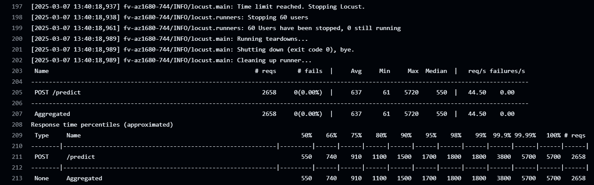
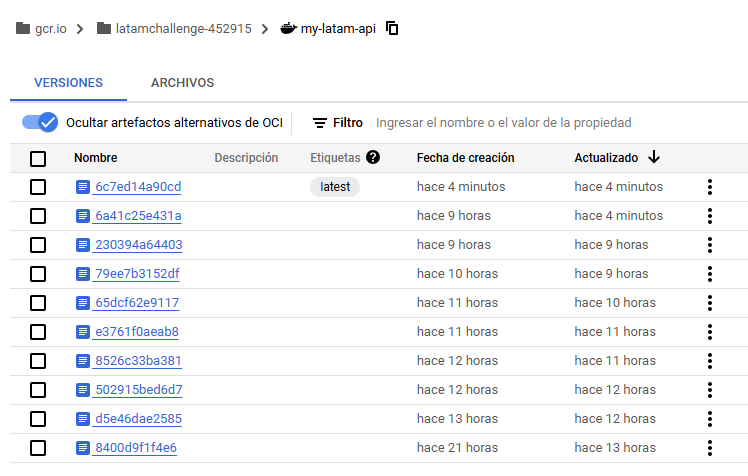
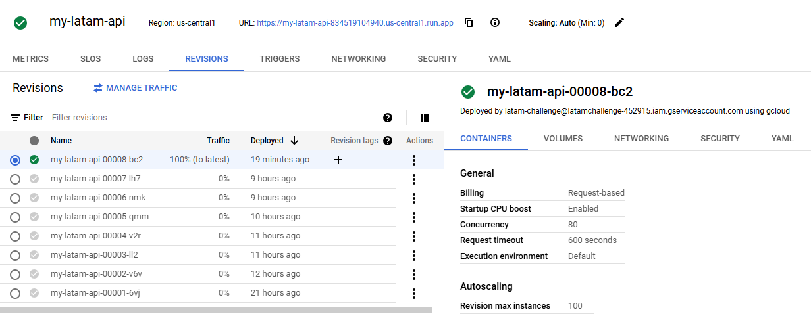

[](https://github.com/ai-product-manager/latam-challenge/actions/workflows/ci.yml)

[](https://github.com/ai-product-manager/latam-challenge/actions/workflows/cd.yml)

# Challenge Documentation

## 1. Executive Overview

Airports face significant challenges when flights are delayed, which directly impacts operational efficiency and customer satisfaction. Our solution transforms a data science notebook into a production-grade, scalable service that delivers **real-time flight delay predictions**. We achieved this by building a robust pipeline composed of four integrated parts:

- **Part I - Model**
- **Part II - API**
- **Part III - Deployment**
- **Part IV - CI/CD & Code Quality Best Practices**

This document focuses on **Part I – Model**, explaining our model selection, key implementation details, and test results.

---

## 2. Part I – Model

### 2.1 Business Context and Model Selection

Flight delays can have a cascading impact on airport operations. To mitigate these issues, we developed a predictive model to forecast delays in real time. During our exploratory phase (documented in our Jupyter Notebook), we evaluated several algorithms:
- **Logistic Regression:** Simple and fast but underperformed in capturing the minority class (delayed flights).
- **XGBoost (XGBClassifier):** Delivered superior predictive performance, especially when addressing class imbalance through the `scale_pos_weight` parameter.

After comparing key performance metrics (accuracy, precision, recall, f1-score, and AUC), we observed the following:

| Model                              | Accuracy | Macro Precision | Macro Recall | Macro F1 | Weighted Precision | Weighted Recall | Weighted F1 |
|------------------------------------|----------|-----------------|--------------|----------|--------------------|-----------------|-------------|
| XGBoost (with Balance)             | 0.55     | 0.56            | 0.61         | 0.51     | 0.76               | 0.55            | 0.60        |
| XGBoost (without Balance)          | 0.81     | 0.79            | 0.50         | 0.45     | 0.80               | 0.81            | 0.73        |
| Logistic Regression (with Balance) | 0.55     | 0.56            | 0.60         | 0.51     | 0.76               | 0.55            | 0.60        |
| Logistic Regression (without Balance) | 0.81  | 0.67            | 0.51         | 0.46     | 0.76               | 0.81            | 0.73        |

**Key Observations:**
- When no balancing is applied, both models achieve high accuracy but fail to adequately capture delayed flights (very low recall for class 1).
- With balancing, XGBoost improves the recall for the minority class (delays), which is critical in our use case.
- XGBoost’s advanced handling of feature importance further informs which factors drive delays, supporting continuous model improvement.

**Model Selection Rationale:**
- **XGBoost with Balance** is chosen because its recall (0.61 for delayed flights) meets our operational threshold. Capturing a high percentage of delays is vital to avoid unexpected disruptions.
- It also provides a detailed feature importance analysis, which is essential for transparency and future enhancements.
- Our implementation in `model.py` uses XGBoost with a balancing factor (multiplied by 1.3), which aligns with our experimental results and business requirements.

---

### 2.2 Implementation in model.py

Below is a key snippet from our `DelayModel` class, illustrating how we handle class imbalance and train our model:

```python
def fit(self, features: pd.DataFrame, target: pd.DataFrame) -> None:
    try:
        x_train, _, y_train, _ = self.__split_data(features, target)
        y_train_arr = y_train.values.ravel()

        # Count the number of negative (class 0) and positive (class 1) samples
        n_y1 = np.sum(y_train_arr == 1)
        n_y0 = np.sum(y_train_arr == 0)

        # Adjust for class imbalance: multiply ratio by 1.3 to emphasize minority class
        scale_weight = (n_y0 / n_y1) * 1.3 if n_y1 > 0 else 1

        # Configure and train the model using XGBoost
        params = {**self._default_model_params, "scale_pos_weight": scale_weight}
        self._model = xgb.XGBClassifier(**params)
        self._model.fit(x_train, y_train_arr)
        logger.info("Model training complete.")
        self.__save(params)
    except Exception as e:  # pylint: disable=broad-exception-caught
        logger.exception("Error in fit: %s", e)
        raise
```

**Highlights:**

- **Class Imbalance Handling:** We compute the ratio of negatives to positives and multiply by 1.3 to enhance sensitivity for the delayed flight class.
- **Model Configuration:** Our hyperparameters (200 estimators, max depth of 8, learning rate of 0.01, etc.) are carefully tuned to capture complex patterns without overfitting.
- **Robust Error Handling:** Any exceptions during training are logged and re-raised, ensuring transparency in case of issues.

### 2.3 Test Results

**Model Unit Tests:**

Executed via make model-test, these tests confirm that our model consistently meets our performance thresholds (e.g., recall above 0.60 for delayed flights) and validate the correctness of our processing logic.


### 2.4 Conclusion for Part I – Model

By selecting XGBoost, we achieved high predictive accuracy while efficiently handling class imbalances. The resulting ```DelayModel``` class is modular and easy to integrate into our API, forming the backbone of our real-time flight delay prediction system. This robust model supports our broader goal of delivering timely insights to improve airport operations and enhance customer satisfaction.

---

## 3. Part II – API

### 3.1 Business Context

To maximize the impact of our predictive model, we needed to expose it as a RESTful API so that various stakeholders (e.g., airport operations, passenger apps) can query predictions in real time.

### 3.2 Technical Implementation

We built a FastAPI service with two main endpoints:

- **GET /health:** A simple health check that returns ```{"status": "OK"}```.
- **POST /predict:** Accepts a batch of flight data (with fields "OPERA", "TIPOVUELO", and "MES") and returns predicted delay statuses.

Below is a simplified snippet of our FastAPI implementation:

```python
@app.post("/predict", status_code=200)
async def post_predict(batch: FlightBatch) -> dict:
    try:
        # Convert flight batch to a DataFrame
        df = pd.DataFrame([flight.dict() for flight in batch.flights])
        # Preprocess data and predict using DelayModel
        features = model.preprocess(df)
        predictions = model.predict(features)
        return {"predict": predictions}
    except ValueError as ve:
        raise HTTPException(status_code=400, detail=str(ve)) from ve
    except Exception as e:
        raise HTTPException(status_code=500, detail=str(e)) from e
```

**Testing Results:**

**API Tests (make api-test):**
- The API endpoints have been thoroughly tested using automated tests. Input validation via Pydantic ensures only valid data is processed, and responses match expected outcomes.


---
## 4. Part III – Deployment

### 4.1 Business Context

For a production-ready system, the API must be deployed in a scalable and reliable environment. We chose Google Cloud Run for its serverless capabilities, which enable automatic scaling and reduce operational overhead.

### 4.2 Technical Implementation

Our deployment process includes:

- Containerization:
The API is packaged using a Dockerfile. Key details include:
  - Base Image: python:3.12-slim
  - Dependencies: Installed from requirements.txt
  -Port Configuration: The container is set to listen on port 8000 (Cloud Run automatically sets the PORT variable; our Dockerfile ensures that uvicorn listens on this port).

```dockerfile
# syntax=docker/dockerfile:1.2
# Using this image due the application was developed with this version and is a lightweight official Python image
FROM python:3.12-slim

# Set the working directory inside the container
WORKDIR /app

# Install system dependencies
RUN apt update && apt install -y gcc g++ python3-dev libpq-dev

# Copy the project files into the container
COPY challenge /app/challenge
COPY data /app/data
COPY requirements.txt /app/

# Install dependencies
RUN pip install --no-cache-dir --upgrade pip
RUN pip install -r /app/requirements.txt

# Expose the port that FastAPI runs on
EXPOSE 8000

# Command to run the application
CMD ["uvicorn", "challenge.api:app", "--host", "0.0.0.0", "--port", "8000"]
```

- Deployment via Cloud Run:
We deploy the container to Cloud Run using a GitHub Actions workflow (cd.yml) that builds, pushes, and deploys the Docker image.

Local Deployment Process (as verified):

```bash
gcloud auth login
gcloud config set project latamchallenge-452915
gcloud auth configure-docker gcr.io
docker push gcr.io/latamchallenge-452915/my-latam-api:latest
gcloud services enable run.googleapis.com
gcloud run deploy my-latam-api --image gcr.io/latamchallenge-452915/my-latam-api:latest --platform managed --region us-central1 --allow-unauthenticated --port 8000
make stress-test
```


**Stress Tests:**

- Our stress testing (make stress-test) simulated high traffic loads, achieving:
During a 60-second stress test, the API handled over 2658 requests with:
  - Median Response Time: ~550ms
  - Average Response Time: ~637ms
  - Some outliers up to ~5.7 seconds under peak load, which are being analyzed for further optimization.



---
## 5. Part IV – CI/CD & Code Quality Best Practices

### 5.1 CI/CD Pipelines
We leverage GitHub Actions for both continuous integration and delivery:

- Continuous Integration (ci.yml):
  - Checks out the repo and sets up Python.
  - Creates a virtual environment, installs dependencies.
  - Runs unit tests (model and API) and coverage reports.
  - Applies linting (Pylint) and code formatting (Black).

- Continuous Delivery (cd.yml):
  - Authenticates with GCP using a service account key stored in GitHub Secrets (e.g., GCP_SA_KEY) for security and compliance.
  - Builds and pushes a new Docker image to Google Container Registry:

```yaml
- name: Build Docker image
  run: |
    docker build -t gcr.io/${{ secrets.PROJECT_ID }}/my-latam-api:latest .

- name: Push Docker image
  run: |
    docker push gcr.io/${{ secrets.PROJECT_ID }}/my-latam-api:latest
```



- Deploys automatically to Cloud Run, URL de la API - [my-latam-api](https://my-latam-api-834519104940.us-central1.run.app/health):

```yaml
- name: Deploy to Cloud Run
  uses: google-github-actions/deploy-cloudrun@v2
  with:
    service: ${{ secrets.CLOUD_RUN_SERVICE }}
    region: ${{ secrets.REGION }}
    image: gcr.io/${{ secrets.PROJECT_ID }}/my-latam-api:latest
```



- Secrets Management:
  - We store credentials (service account JSON, project ID, etc.) in GitHub Secrets.
  - This approach ensures sensitive data is not committed to the repository, meeting security and compliance requirements.

### 5.2 Docker Image & Cloud Run Updates

Every merge into ```main``` triggers the CD pipeline:

1. Builds a fresh Docker image with the latest code.
2. Pushes it to GCR with a consistent tag (e.g., latest) or a commit-based tag for versioning.
3. Deploys the updated image to Cloud Run, creating a new revision for zero-downtime updates.

### 5.3 GitFlow Branching Strategy

- ```main```: Stable production branch.
- ```dev```: Integration branch where features are merged after initial testing.
- ```feature/*```: Short-lived branches for new features (e.g., ```feature/api```, ```feature/cicd```, etc.). 
- Merges from ```feature/*``` → ```dev``` → ```main``` ensures a clear path from development to production.

This branching model ensures a clean development workflow and predictable release cycle.

### 5.4 Code Refactoring & Best Practices
- Black: Enforces consistent Python code formatting across all modules.
- Pylint: Detects potential errors, enforces coding standards.
- Automated Testing: Ensures every commit is validated before deployment, reducing risk of production issues.


**Badges:**

Our repository includes CI/CD badges in the README that provide instant feedback on build, test, and deployment statuses.

- **CI:** All unit and API tests pass with high coverage.
- **CD:** Automated deployments update the Cloud Run service seamlessly after code merges to ```main```.

---
## 6. Business Impact & Next Steps

**Business Impact**

- **Operational Efficiency:** Real-time delay predictions enable proactive resource allocation, reducing downtime and optimizing gate assignments.
- **Enhanced Customer Experience:** By predicting delays, the airport can provide timely updates to passengers, reducing frustration.
- **Scalability:** Cloud Run’s serverless architecture automatically scales based on demand, ensuring reliable performance during peak travel periods.
- **Reduced Time-to-Market:** Automated CI/CD pipelines allow for rapid deployment of improvements and new features.

**Next Steps**

- **Traffic Splitting and A/B Testing:** Gradually roll out new model versions to test improvements without disrupting service.
- **Advanced Monitoring:** Integrate with Google Cloud Monitoring to set up alerts and dashboards.
- **Feature Expansion:** Incorporate additional data sources to further enhance prediction accuracy.
- **Integration:** Expand API integrations with airport systems and mobile apps for real-time operational insights.